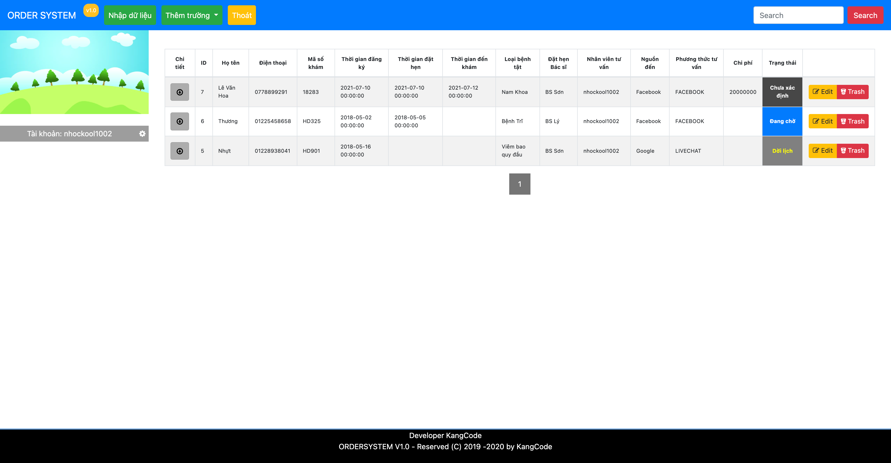
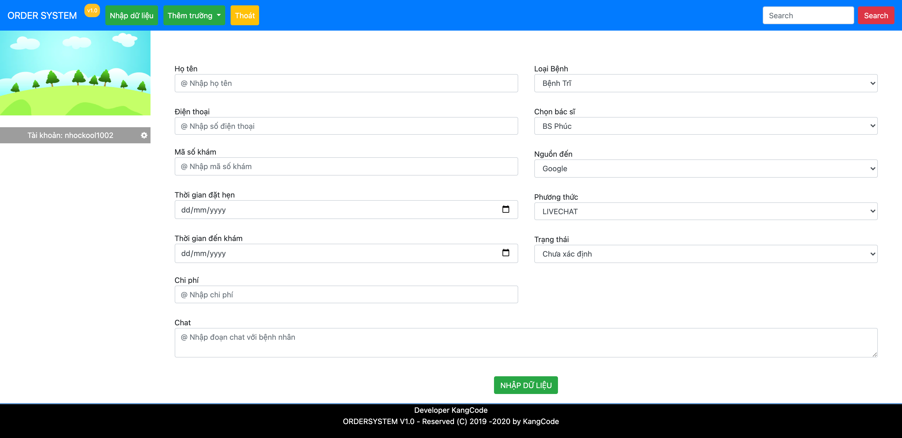
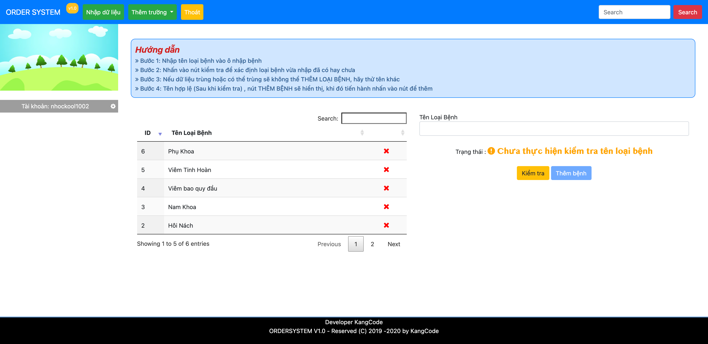
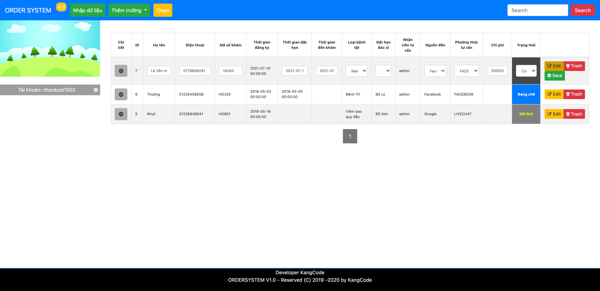

# **Order System - Hệ thống đặt hẹn**

## **Description - Mô tả**

- **Order System** is an application that stores patient information to visit the clinic.

- **Order System** là ứng dụng lưu trữ thông tin bệnh nhân đến khám tại phòng khám.

## **Setup - Cài đặt**

- Go to _**config/config.php**_ and setup informations - Di chuyển tới _**config/config.php**_ và cài đặt các thông tin

> HOST = '';  
> DB_NAME = '';  
> DB_USER = '';  
> DB_PASS = '';  
> ROOT = '';

- Import _**sql/sql.sql**_ into databases - Nhập _**sql/sql.sql**_ vào cơ sở dữ liệu

- Go to _**localhost/index.php**_ and login with below info - Di chuyển tới _**localhost/index.php**_ và login với thông tin bên dưới
  > username: admin  
  > password: 111111  

## **Picture - Hình ảnh**

**General - Tổng quan**

**Form Typing - Nhập liệu**

**Adding Data - Nhập loại bệnh**

**Table Edit - Sửa dữ liệu trên bảng**

